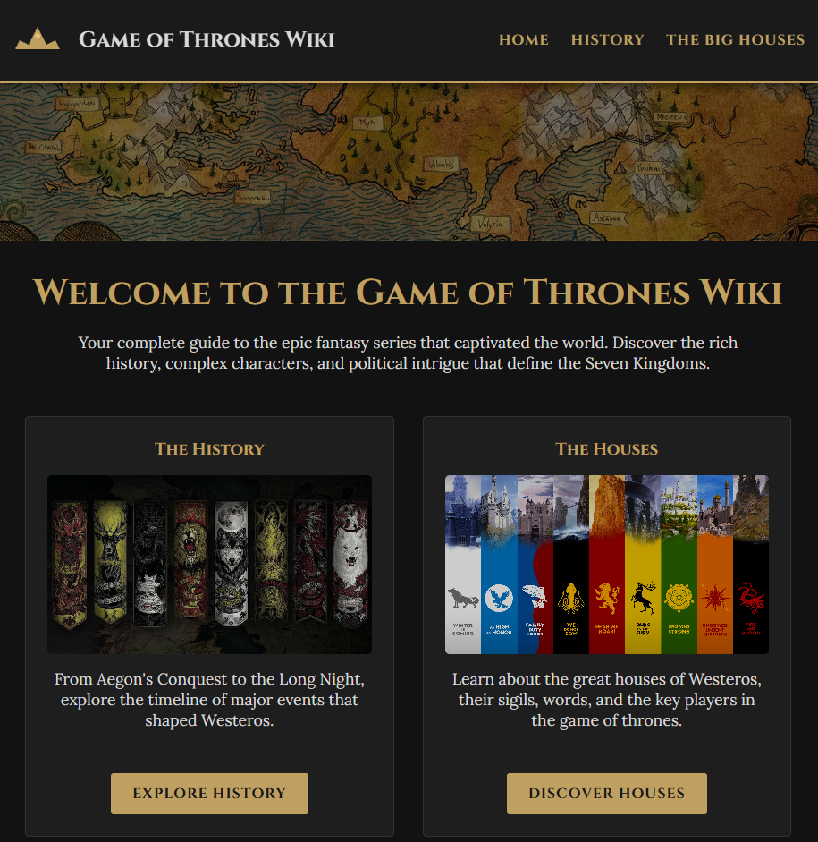
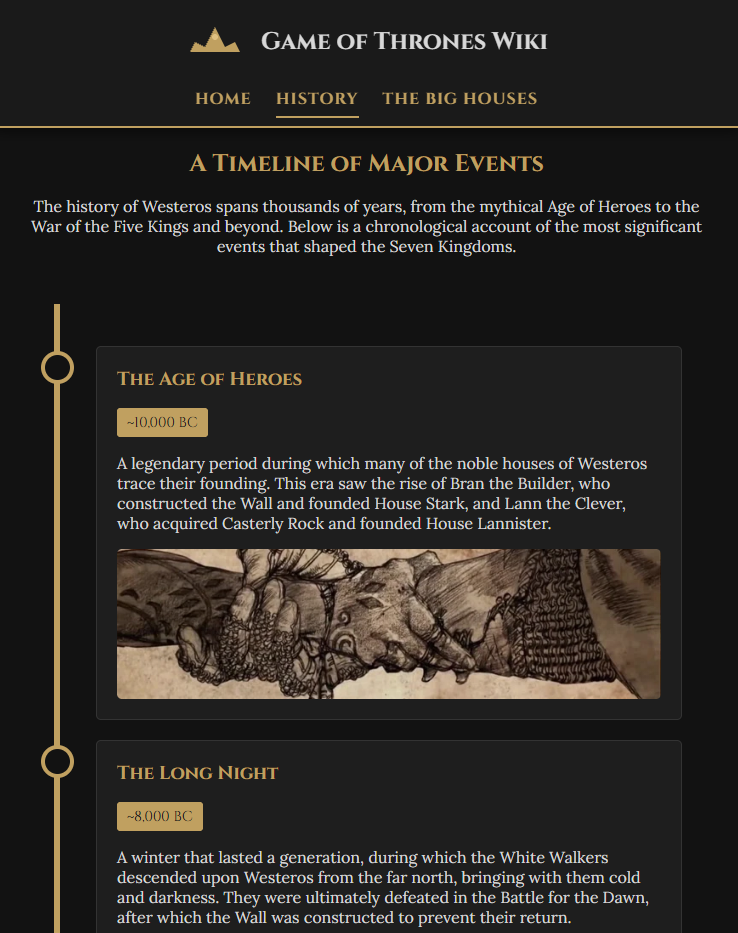
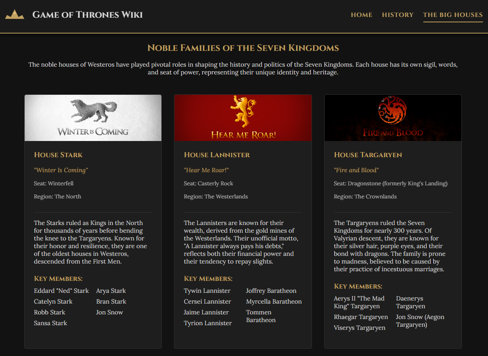

# Game of Thrones Wiki

A fan-made interactive website dedicated to the epic fantasy series Game of Thrones. Explore the rich history, noble houses, and immersive multimedia content from the Seven Kingdoms.

---

## Table of Contents

- [Overview](#overview)
- [Features](#features)
- [Technologies](#technologies)
- [Project Structure](#project-structure)
- [Pages](#pages)
- [Installation](#installation)
- [Usage](#usage)
- [Screenshots](#screenshots)
- [Credits](#credits)
- [License](#license)

## Overview

This project is a multimedia website that celebrates the world of Game of Thrones. It features a medieval-inspired design with interactive elements, rotating quotes from iconic characters, and comprehensive information about the history and great houses of Westeros.

## Features

### 🎨 Design & UI

- **Medieval Aesthetic**: Dark theme with gold accents inspired by Game of Thrones
- **Responsive Design**: Fully responsive layout that works on all devices
- **Smooth Animations**: Fade-in effects, hover animations, and smooth transitions
- **Interactive Navigation**: Sticky header that hides on scroll with smooth animations

### 📜 Content

- **Home Page**: Introduction with featured sections and rotating quotes
- **History Page**: Interactive timeline of major events in Westeros
- **Houses Page**: Detailed cards for the Great Houses with sigils and information

### 🎭 Interactive Elements

- **Rotating Quotes**: 12 iconic quotes that change every 6 seconds with fade effects
- **Canvas Logo**: Custom-drawn crown logo using HTML5 Canvas
- **Audio Player**: Interactive audio player for the main theme
- **Hover Effects**: Cards and buttons with elegant hover animations

### 🎵 Multimedia

- Audio player with Game of Thrones main theme
- Download protection on audio controls
- Custom-styled audio player matching the medieval theme

### 🔗 Navigation

- Clickable logo and site title that return to home
- Active page indicators in navigation
- Footer with social links and disclaimer

## Technologies

- **HTML5**: Semantic markup and Canvas API
- **CSS3**:
  - CSS Variables for theming
  - Flexbox and Grid layouts
  - Custom animations and transitions
  - Media queries for responsiveness
- **JavaScript (ES6+)**:
  - DOM manipulation
  - Event listeners
  - Intersection Observer API
  - Dynamic content rotation
- **Fonts**:
  - Google Fonts (Cinzel, Lora)
  - Custom typography for a medieval feel

## Project Structure

```
proyecto-multimedia/
├── index.html
├── src/
│   ├── assets/
│   │   ├── images/        # All image assets
│   │   ├── videos/        # Video files
│   │   └── audios/        # Audio files
│   ├── css/
│   │   └── styles.css     # Main stylesheet
│   ├── js/
│   │   ├── main.js        # Main JavaScript functionality
│   │   └── canvas-logo.js # Canvas drawing logic
│   └── pages/
│       ├── history.html   # History timeline page
│       └── houses.html    # Great Houses page
└── README.md
```

## Pages

### 🏠 Home (`index.html`)

- Hero section with dramatic background
- Featured content cards (History & Houses)
- Rotating quotes section with medieval styling
- Media section with audio player

### ⏳ History (`src/pages/history.html`)

- Timeline of major events in Westeros' history
- Interactive timeline design
- Historical artifacts section
- Events from the Age of Heroes to the Great War

### 🏰 Houses (`src/pages/houses.html`)

- Cards for the six great houses:
  - House Stark (The North)
  - House Lannister (The Westerlands)
  - House Targaryen (Dragonstone)
  - House Baratheon (The Stormlands)
  - House Tyrell (The Reach)
  - House Greyjoy (Iron Islands)
- House words, seats, and key members

## Installation

1. Clone the repository:

```bash
git clone https://github.com/arturoguerreronc/fm-got-wiki.git
```

2. Navigate to the project directory:

```bash
cd fm-got-wiki
```

3. Open `index.html` in your browser or use a local server:

```bash
# Using Python
python -m http.server 8000

# Using Node.js (http-server)
npx http-server

# Using VS Code Live Server extension
# Right-click on index.html -> Open with Live Server
```

4. Visit `http://localhost:8000` in your browser

## Usage

### Navigation

- Click on the logo or site title to return to the home page
- Use the navigation menu to browse between pages
- Active page is highlighted in the navigation

### Interactive Features

- Quotes change automatically every 6 seconds
- Hover over cards to see elevation effects
- Scroll down to hide the header, scroll up to reveal it
- Audio player with download protection and custom styling

### Media Controls

- Audio player has download protection
- Custom-styled controls matching the medieval theme
- Centered audio player with elegant styling

## Screenshots

### Home Page

The landing page features a dramatic hero section and rotating quotes from iconic characters.



### History Timeline

An interactive timeline showcasing major events in the history of Westeros.



### Great Houses

Detailed information cards for each of the major houses of the Seven Kingdoms.



## Key Features Explained

### Rotating Quotes System

The rotating quotes feature creates a dynamic display of 12 iconic quotes from Game of Thrones characters, providing an immersive experience on the home page.

**How it works:**

1. **Quote Array**: A collection of 12 carefully selected quotes is stored in an array, each with the quote text and its author:

   ```javascript
   const quotes = [
     { text: "When you play the game of thrones...", author: "Cersei Lannister" },
     { text: "Winter is coming.", author: "House Stark" },
     // ... 10 more quotes
   ];
   ```

2. **Initialization**: On page load, the first quote is displayed immediately:

   ```javascript
   function initRotatingQuotes() {
     // Set initial quote (index 0)
     quoteText.textContent = `"${quotes[0].text}"`;
     quoteAuthor.textContent = `— ${quotes[0].author}`;
     
     // Start rotation every 6 seconds
     setInterval(rotateQuotes, 6000);
   }
   ```

3. **Smooth Transitions**: Every 6 seconds, the quote changes with a fade animation:
   - **Fade out**: Current quote opacity transitions to 0 (500ms)
   - **Content swap**: Quote text and author are updated during the fade
   - **Fade in**: New quote opacity transitions back to 1
   - **Circular rotation**: After the last quote, it loops back to the first

4. **CSS Styling**: The quote container features:
   - Medieval-inspired design with golden borders
   - Decorative corner elements
   - Smooth opacity transitions (0.5s ease-in-out)
   - Responsive typography for all screen sizes

This creates an engaging, cinematic effect that keeps the home page dynamic without being distracting.

### Canvas Logo

A custom-drawn crown logo using HTML5 Canvas API that appears in both the header and footer.

### Smooth Header Animation

The header smoothly hides when scrolling down and reappears when scrolling up, using requestAnimationFrame for optimal performance.

### Medieval Quote Section

- Double borders with golden accents
- Decorative corner elements
- Gradient backgrounds with texture overlays
- Glowing effects on text and borders

## Credits

### Content & Inspiration

- **Game of Thrones**: Created by David Benioff and D.B. Weiss for HBO
- **A Song of Ice and Fire**: Book series by George R.R. Martin

### Assets

- Images: Various sources, including HBO promotional materials and fan artists
- Music: Main theme by Ramin Djawadi
- Fonts: Google Fonts (Cinzel, Lora)

### Developer

- **Arturo Guerrero** - [GitHub](https://github.com/arturoguerreronc)

## Legal Disclaimer

This is a fan-made website created for educational purposes. All content, images, and trademarks are owned by their respective owners. No copyright infringement intended.

- Game of Thrones © HBO
- A Song of Ice and Fire © George R.R. Martin
- All media content used under fair use for educational purposes

## License

This project is licensed under the MIT License. The project is open source and available for educational purposes. Feel free to use it as a reference for your own projects.

**Note**: This license applies to the code only. All Game of Thrones content, images, and media are owned by their respective copyright holders (HBO, George R.R. Martin, etc.).

---

**Made with ♥ by [Arturo](https://github.com/arturoguerreronc)**

*The night is dark and full of terrors, but this website is here to guide you through the Seven Kingdoms!* 🏰⚔️
